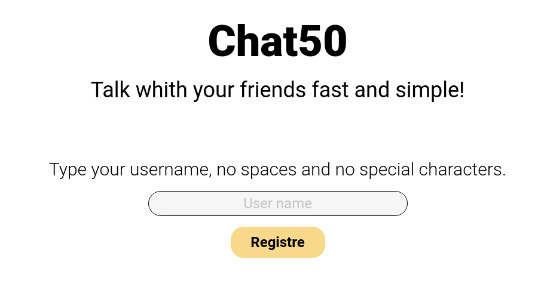
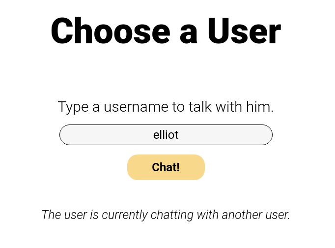
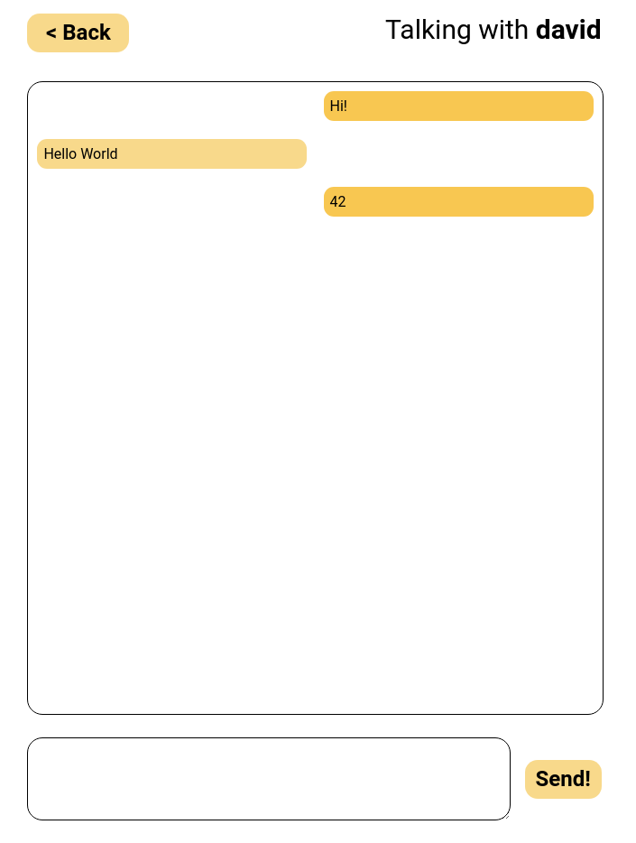

# Chat50

Um web chat  para dois usuários conversarem. Neste site dois usuários podem entrar com um *username* qualquer que não esteja sendo utilizado por outro usuário, e, utilizando ele como identificador, conversarem entre si por meio de um chat.


# Motivação

Este foi o projeto final do curso CS50x.


# Tecnologias Utilizadas

- Python
- HTML
- Javascript
- [Flask](https://flask.palletsprojects.com/en/1.1.x/)
- [Flask-Socketio](https://flask-socketio.readthedocs.io/en/latest/)
- Socketjs
- Jquery


# Instalação e Execução

1. Instale o Python 3

2. Instale os pacotes `flask` e `flask-socketio`

   ```shell
   pip install flask
   pip install flask-socketio
   ```

3. Baixe os arquivos e no diretório onde está `app.py` execute

   ```
   flask run
   ```

4. Abra no navegador o endereço web que irá aparecer após a execução do comando acima, geralmente `http://127.0.0.1:5000/`


# Como usar?

1. Na página inicial no campo *User Name* digite um nome de usuário que será usado como identificador seu, e clique em *Registre*
2. O próxima página será *Choose User* nestá página você deve digitar o nome de outro usuário para conversar com ele. No entanto isso só será possível se ele também tiver digitado seu nome, caso não tenha, há duas possibilidades ou ele está falando com outro usuário ou não está falando com ninguém. No primeiro caso uma menssagem dizendo que ele está ocupado é exibida, já no segundo caso uma menssagem para aguardar o usuário digitar o seu nome é exibida.
3. Quando vocês tiverem digitado o nome um do outro, a página *Chat* será exibida, onde é possível se comunicar, para isto basta digitar a menssagem na caixa de texto e clicar en *Send!* , as menssagens são exibidas na caixa acima.


# Screenshots

- Página inicial

  

- Página *Choose User*

  

- Página *Chat*

  


# Créditos

1. [Building your first chat application using flaks](https://codeburst.io/building-your-first-chat-application-using-flask-in-7-minutes-f98de4adfa5d)

